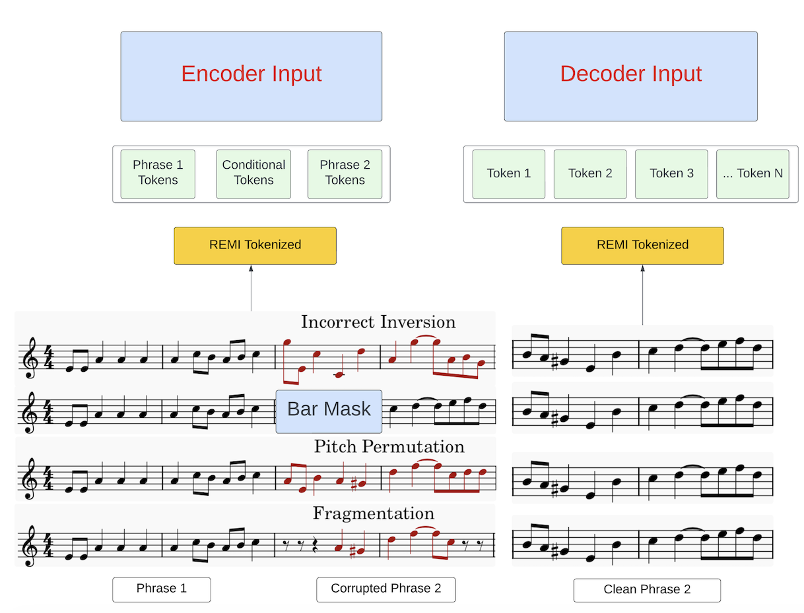
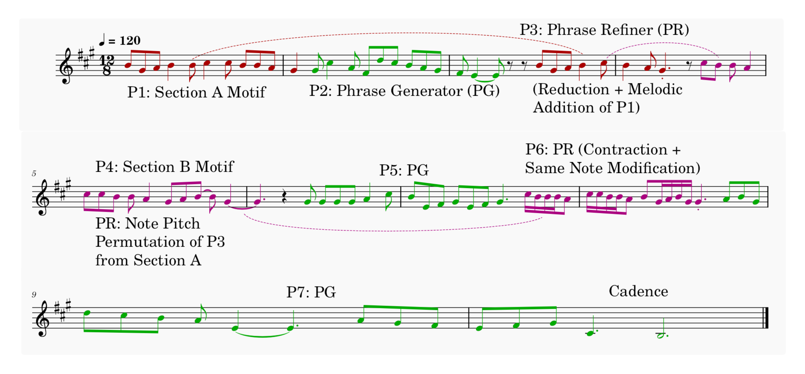

# Yin-Yang: Developing Motifs With Long-Term Structure and Controllability

🌐 [**Demo Website**](https://keshavbhandari.github.io/portfolio/yin-yang.html)

📄 [**ArXiv Paper**](https://arxiv.org/abs/your-paper-id) 

🚀 [**Run in Colab**](https://colab.research.google.com/drive/1qsS9pX4grGVVLk4N5W19DZRk9j2ftLN9#scrollTo=byBfZDvFZ5cJ)  



---

## Overview

Yin-Yang is a novel framework for generating music that maintains long-term structure and motivic development. By leveraging a phrase generator, refiner, and selector model, it achieves the following:

- **Coherent generation** of melodies with long term structure.
- **Controllability** of musical structure and motivic transformations.
- **Semi-interpretable outputs** for musical analysis.

If you're curious about the research behind this framework, check out the paper:  
**Bhandari, K., Wiggins, G. A., & Colton, S. (2025, March). Yin-Yang: Developing Motifs With Long-Term Structure And Controllability.**  
*International Conference on Computational Intelligence in Music, Sound, Art and Design (Part of EvoStar)*.  

---

## Setup Instructions

### 1. Clone the repository and install dependencies
```bash
!git clone https://github.com/keshavbhandari/yinyang.git
%cd yinyang
%pip install -r requirements.txt
```

### 2. Download data and model artifacts
```bash
import gdown

# Download dataset
data_url = 'https://drive.google.com/uc?id=1DhtQV0-jVH1lOreqXY5V8L1qHOSO5PwZ'
data_out = '/content/yinyang/data.zip'
gdown.download(data_url, data_out, quiet=False)

# Download model artifacts
artifacts_url = 'https://drive.google.com/uc?id=1cMGRjUonP3qoKtHA_gqc39GZA4O_zdbh'
artifacts_out = '/content/yinyang/artifacts.zip'
gdown.download(artifacts_url, artifacts_out, quiet=False)

# Unzip files
!unzip -q /content/yinyang/artifacts.zip -d /content/yinyang/
!unzip -q /content/yinyang/data.zip -d /content/yinyang/
```

### 3. Generate a melody from a motif
Change the generation configs in configs/configs_os.yaml. Look at the examples to change the structure (ABC), phrases per section [4,5,4], use the phrase selection model, specify transformations (optional) and apply key modulations. Then run the following to generate a melody from a phrase containing the motif:

```bash
!python generate.py --config configs/configs_os.yaml
```

### 4. Recreate experiments by training models from scratch
To train individual models, use the following commands:

- Train the phrase refiner model:
  ```bash
  !python phrase_refiner/train.py --config configs/configs_os.yaml
  ```
- Train the phrase generator model:
  ```bash
  !python phrase_generator/train.py --config configs/configs_os.yaml
  ```
- Train the phrase selector model:
  ```bash
  !python phrase_selector/train.py --config configs/configs_os.yaml
  ```
- Train the structure derivation model:
  ```bash
  !python structure_derivation/train.py --config configs/configs_os.yaml
  ```

## Citation

If you use this repository in your work, please cite:

```plaintext
@inproceedings{bhandari2025yin,
  title={Yin-Yang: Developing Motifs With Long-Term Structure and Controllability},
  author={Bhandari, Keshav and Wiggins, Geraint A. and Colton, Simon},
  booktitle={International Conference on Computational Intelligence in Music, Sound, Art and Design (Part of EvoStar)},
  year={2025}
}
